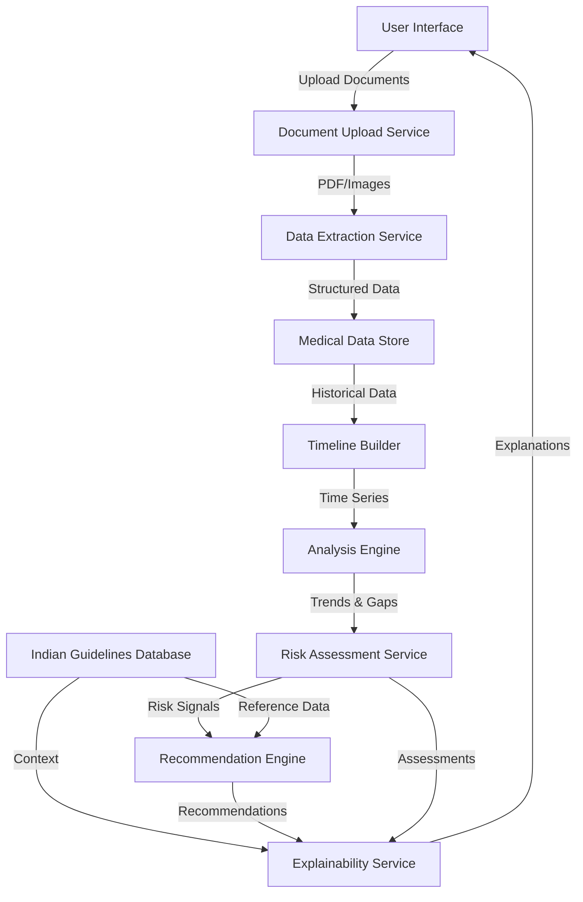

# Design Document: Preventive Health Intelligence System

## Overview

The Preventive Health Intelligence System is an AI-powered platform that analyzes longitudinal medical data to provide explainable risk awareness and preventive guidance. The system treats the absence of routine medical testing as a risk signal and helps users understand silently accumulating health risks without diagnosing diseases or prescribing treatments.

The system consists of four main components:
1. **Data Ingestion Pipeline**: Extracts structured data from medical documents
2. **Analysis Engine**: Performs longitudinal analysis, gap detection, and risk assessment
3. **Recommendation Engine**: Generates personalized preventive test recommendations
4. **Explainability Layer**: Provides clear, understandable reasoning for all assessments

The design emphasizes responsible AI principles, Indian healthcare context adaptation, and user empowerment through transparent, evidence-based guidance.

## Architecture

### High-Level Architecture



### Component Architecture

The system follows a layered architecture:

**Presentation Layer**:
- Web/Mobile UI for document upload and result visualization
- Multi-language support for Indian languages
- Accessible, user-friendly interface with clear explanations

**Application Layer**:
- Data Ingestion Pipeline
- Analysis Engine
- Recommendation Engine
- Explainability Service

**Data Layer**:
- Encrypted Medical Data Store
- Indian Guidelines Database
- User Profile Store
- Audit Log Store

**Integration Layer**:
- OCR/Document Processing APIs
- Medical terminology databases
- Notification services

## Components and Interfaces

### 1. Data Extraction Service

**Purpose**: Extract structured data from uploaded medical documents (lab reports, prescriptions).

**Key Functions**:
- `extract_lab_report(document: Document) -> LabReport`: Extracts test results, reference ranges, and dates
- `extract_prescription(document: Document) -> Prescription`: Extracts medications, dosages, and duration
- `validate_extraction(data: ExtractedData) -> ValidationResult`: Validates completeness and flags ambiguities
- `normalize_test_names(test_name: str) -> StandardTestName`: Maps Indian test names to standard nomenclature

**Interfaces**:
```
Document {
  id: string
  type: enum [LAB_REPORT, PRESCRIPTION]
  format: enum [PDF, IMAGE]
  content: bytes
  upload_date: timestamp
}

LabReport {
  id: string
  user_id: string
  test_date: date
  lab_name: string
  tests: List<TestResult>
  flags: List<string>  // ambiguities or issues
}

TestResult {
  test_name: string
  standard_name: string
  value: float
  unit: string
  reference_range: Range
  status: enum [NORMAL, LOW, HIGH, CRITICAL]
}

Prescription {
  id: string
  user_id: string
  prescription_date: date
  doctor_name: string
  medications: List<Medication>
  follow_up_date: date?
}

Medication {
  name: string
  dosage: string
  frequency: string
  duration: string
}
```

### 2. Timeline Builder

**Purpose**: Organize medical data chronologically and build a longitudinal view.

**Key Functions**:
- `build_timeline(user_id: string) -> Timeline`: Creates chronological view of all medical data
- `get_parameter_history(user_id: string, parameter: string) -> List<DataPoint>`: Retrieves history for specific parameter
- `calculate_time_since_last_test(user_id: string, test_type: string) -> Duration`: Calculates elapsed time

**Interfaces**:
```
Timeline {
  user_id: string
  events: List<TimelineEvent>
  parameters: Map<string, List<DataPoint>>
}

TimelineEvent {
  date: date
  type: enum [LAB_TEST, PRESCRIPTION, FOLLOW_UP]
  data: LabReport | Prescription
}

DataPoint {
  date: date
  value: float
  unit: string
  source: string  // which lab report
}
```

### 3. Analysis Engine

**Purpose**: Perform longitudinal analysis to detect trends, gaps, and patterns.

**Key Functions**:
- `detect_trends(parameter_history: List<DataPoint>) -> Trend`: Identifies upward/downward trends
- `detect_gaps(user_profile: UserProfile, timeline: Timeline) -> List<Gap>`: Identifies missing tests
- `track_follow_ups(timeline: Timeline) -> List<FollowUp>`: Tracks overdue follow-ups
- `calculate_trend_significance(trend: Trend) -> Significance`: Determines clinical significance

**Interfaces**:
```
Trend {
  parameter: string
  direction: enum [INCREASING, DECREASING, STABLE]
  rate_of_change: float
  significance: enum [LOW, MODERATE, HIGH]
  data_points: List<DataPoint>
  confidence: float
}

Gap {
  test_type: string
  recommended_frequency: Duration
  last_test_date: date?
  days_overdue: int
  priority: enum [LOW, MODERATE, HIGH]
  reason: string
}

FollowUp {
  original_test: TestResult
  recommended_date: date
  actual_date: date?
  status: enum [PENDING, COMPLETED, OVERDUE]
  days_overdue: int
}
```

### 4. Risk Assessment Service

**Purpose**: Generate risk signals based on trends, gaps, and absence of testing.

**Key Functions**:
- `assess_absence_risk(gap: Gap, user_profile: UserProfile) -> RiskSignal`: Evaluates risk from missing tests
- `assess_trend_risk(trend: Trend, guidelines: Guidelines) -> RiskSignal`: Evaluates risk from concerning trends
- `aggregate_risks(signals: List<RiskSignal>) -> OverallRisk`: Combines multiple risk signals
- `categorize_severity(risk: RiskSignal) -> Severity`: Assigns severity level

**Interfaces**:
```
RiskSignal {
  id: string
  type: enum [ABSENCE, TREND, FOLLOW_UP]
  severity: enum [LOW, MODERATE, HIGH]
  parameter: string
  description: string
  evidence: Evidence
  generated_date: timestamp
}

Evidence {
  data_points: List<DataPoint>
  gaps: List<Gap>
  trends: List<Trend>
  guideline_references: List<string>
}

OverallRisk {
  user_id: string
  risk_score: float  // 0-100
  severity: enum [LOW, MODERATE, HIGH]
  signals: List<RiskSignal>
  assessment_date: timestamp
}
```

### 5. Recommendation Engine

**Purpose**: Generate personalized preventive test recommendations based on risk assessment and guidelines.

**Key Functions**:
- `generate_recommendations(user_profile: UserProfile, risks: OverallRisk) -> List<Recommendation>`: Creates recommendations
- `prioritize_recommendations(recommendations: List<Recommendation>) -> List<Recommendation>`: Orders by importance
- `apply_indian_guidelines(user_profile: UserProfile) -> List<PreventiveTest>`: Applies age/demographic norms
- `customize_for_history(recommendations: List<Recommendation>, timeline: Timeline) -> List<Recommendation>`: Adjusts based on history

**Interfaces**:
```
Recommendation {
  id: string
  test_type: string
  test_name: string
  priority: enum [LOW, MODERATE, HIGH, URGENT]
  reason: string
  frequency: Duration
  related_risks: List<string>  // risk signal IDs
  guideline_reference: string
  estimated_cost_range: string  // Indian context
}

PreventiveTest {
  test_name: string
  standard_name: string
  purpose: string
  recommended_age_range: Range
  recommended_frequency: Duration
  applicable_conditions: List<string>
  indian_guideline_source: string
}

UserProfile {
  user_id: string
  age: int
  gender: enum [MALE, FEMALE, OTHER]
  family_history: List<string>
  lifestyle_factors: Map<string, string>
  has_medical_records: bool
}
```

### 6. Explainability Service

**Purpose**: Provide clear, understandable explanations for all risk assessments and recommendations.

**Key Functions**:
- `explain_risk(risk_signal: RiskSignal) -> Explanation`: Generates explanation for risk
- `explain_recommendation(recommendation: Recommendation) -> Explanation`: Explains why test is recommended
- `visualize_trend(trend: Trend) -> Visualization`: Creates visual representation
- `simplify_language(technical_text: string) -> string`: Converts to simple language

**Interfaces**:
```
Explanation {
  summary: string  // Simple, one-sentence summary
  detailed_reasoning: string  // Detailed explanation
  evidence_visualization: Visualization?
  guideline_citations: List<Citation>
  action_guidance: string  // What user should do
  disclaimer: string  // Not medical advice
}

Visualization {
  type: enum [LINE_CHART, BAR_CHART, TIMELINE]
  data: VisualizationData
  annotations: List<Annotation>
}

Citation {
  source: string
  guideline_name: string
  url: string?
  relevance: string
}
```

### 7. Indian Guidelines Database

**Purpose**: Store and provide access to Indian medical guidelines and preventive norms.

**Key Functions**:
- `get_preventive_guidelines(age: int, gender: string) -> List<PreventiveTest>`: Retrieves age-appropriate guidelines
- `get_test_frequency(test_type: string, risk_factors: List<string>) -> Duration`: Gets recommended frequency
- `get_reference_ranges(test_name: string, demographics: Demographics) -> Range`: Gets Indian population ranges
- `search_guidelines(query: string) -> List<Guideline>`: Searches guideline database

**Data Sources**:
- Indian Council of Medical Research (ICMR) guidelines
- National Health Mission preventive health protocols
- Indian Medical Association recommendations
- State-specific health department guidelines

## Data Models

### Core Data Models

**MedicalDataPoint**:
```
{
  id: UUID
  user_id: UUID
  parameter_name: string
  standard_parameter_name: string
  value: float
  unit: string
  reference_range_min: float?
  reference_range_max: float?
  test_date: date
  source_document_id: UUID
  status: enum [NORMAL, ABNORMAL, CRITICAL]
  created_at: timestamp
}
```

**RiskAssessment**:
```
{
  id: UUID
  user_id: UUID
  assessment_date: timestamp
  overall_risk_score: float
  severity: enum [LOW, MODERATE, HIGH]
  risk_signals: List<RiskSignal>
  recommendations: List<Recommendation>
  explanation: Explanation
  version: int  // for tracking changes over time
}
```

**UserMedicalProfile**:
```
{
  user_id: UUID
  demographic_profile: DemographicProfile
  medical_history_summary: MedicalHistorySummary
  current_medications: List<Medication>
  last_assessment_date: timestamp
  data_completeness_score: float  // 0-100
  created_at: timestamp
  updated_at: timestamp
}
```

**DemographicProfile**:
```
{
  age: int
  gender: enum [MALE, FEMALE, OTHER]
  state: string  // Indian state
  family_history: Map<string, bool>  // disease -> has_history
  lifestyle_factors: {
    smoking: bool
    alcohol: bool
    exercise_frequency: string
    diet_type: string
  }
}
```

**MedicalHistorySummary**:
```
{
  first_record_date: date
  last_record_date: date
  total_lab_reports: int
  total_prescriptions: int
  parameters_tracked: List<string>
  chronic_conditions: List<string>
  test_coverage: Map<string, date>  // test_type -> last_test_date
}
```

### Guideline Data Models

**PreventiveGuideline**:
```
{
  id: UUID
  guideline_name: string
  source_organization: string
  test_type: string
  target_population: {
    age_min: int?
    age_max: int?
    gender: string?
    risk_factors: List<string>
  }
  recommended_frequency: Duration
  rationale: string
  evidence_level: enum [HIGH, MODERATE, LOW]
  indian_context_notes: string
  last_updated: date
}
```

## AI/ML Components

### Trend Detection Algorithm

**Approach**: Statistical analysis with clinical context

**Algorithm**:
1. Collect time-series data for parameter
2. Apply moving average smoothing
3. Calculate linear regression slope
4. Determine statistical significance (p-value < 0.05)
5. Apply clinical thresholds for Indian population
6. Generate confidence score based on data points and variance

**Considerations**:
- Minimum 3 data points required for trend detection
- Account for seasonal variations (e.g., vitamin D levels)
- Use Indian population reference ranges
- Flag rapid changes (>20% in 3 months) as high priority

### Gap Detection Algorithm

**Approach**: Rule-based system with guideline matching

**Algorithm**:
1. Load user demographic profile
2. Query Indian Guidelines Database for applicable tests
3. For each recommended test:
   - Check if test exists in user timeline
   - Calculate days since last test
   - Compare against recommended frequency
   - Calculate priority score based on overdue duration
4. Generate gap list sorted by priority

**Priority Scoring**:
```
priority_score = (days_overdue / recommended_frequency_days) * risk_weight
risk_weight = {
  cancer_screening: 3.0,
  diabetes_screening: 2.5,
  cardiovascular_screening: 2.5,
  general_wellness: 1.0
}
```

### Risk Assessment Model

**Approach**: Multi-factor risk scoring with explainable rules

**Risk Factors**:
1. **Absence Risk**: No testing for recommended duration
2. **Trend Risk**: Concerning parameter trends
3. **Follow-up Risk**: Missed follow-up tests
4. **Demographic Risk**: Age/family history factors

**Risk Calculation**:
```
overall_risk = weighted_sum([
  absence_risk * 0.4,
  trend_risk * 0.3,
  follow_up_risk * 0.2,
  demographic_risk * 0.1
])

severity = {
  0-30: LOW,
  31-60: MODERATE,
  61-100: HIGH
}
```

**Explainability**: Each risk component includes:
- Contributing factors with weights
- Guideline references
- Data evidence (charts, timelines)
- Plain language explanation

### Document Extraction Pipeline

**Approach**: OCR + NLP + Pattern Matching

**Pipeline Stages**:
1. **Document Classification**: Identify document type (lab report vs prescription)
2. **OCR Processing**: Extract text from PDF/images using Tesseract or cloud OCR
3. **Layout Analysis**: Identify tables, sections, headers
4. **Entity Extraction**: Extract test names, values, units, dates using NER
5. **Normalization**: Map to standard test names and units
6. **Validation**: Check for completeness and flag ambiguities

**Indian Context Adaptations**:
- Support for multiple Indian languages (Hindi, Tamil, Telugu, etc.)
- Recognition of common Indian lab formats (Thyrocare, Dr. Lal PathLabs, etc.)
- Handling of Indian medical terminology and abbreviations
- Support for handwritten prescriptions (common in India)

### Recommendation Personalization

**Approach**: Guideline-based with contextual adaptation

**Personalization Factors**:
1. Age and gender
2. Existing medical history
3. Family history
4. Geographic location (state-specific guidelines)
5. Previous test results and trends
6. Socioeconomic context (test availability and cost)

**Algorithm**:
```
1. Load base guidelines for user demographics
2. Filter by applicable risk factors
3. Remove tests already completed recently
4. Adjust frequency based on risk signals
5. Prioritize by urgency and clinical importance
6. Add cost and availability context for Indian healthcare
```


## Correctness Properties

*A property is a characteristic or behavior that should hold true across all valid executions of a system—essentially, a formal statement about what the system should do. Properties serve as the bridge between human-readable specifications and machine-verifiable correctness guarantees.*

### Data Ingestion Properties

**Property 1: Document extraction completeness**
*For any* medical document (lab report or prescription), when extracted, the resulting structured data should contain all required fields (date, source, and at least one data element).
**Validates: Requirements 1.1, 1.2**

**Property 2: Ambiguity flagging**
*For any* document with ambiguous or unclear information, the extraction process should generate at least one flag indicating the ambiguity.
**Validates: Requirements 1.3**

**Property 3: Data storage round-trip**
*For any* extracted medical data, storing it and then retrieving it should produce equivalent data with timestamps preserved.
**Validates: Requirements 1.4**

### Longitudinal Analysis Properties

**Property 4: Trend detection consistency**
*For any* time series of health parameter data with a monotonic trend (consistently increasing or decreasing), the trend detection algorithm should identify the trend direction correctly.
**Validates: Requirements 2.1, 2.2**

**Property 5: Time elapsed calculation accuracy**
*For any* two dates in a timeline, the calculated elapsed time should equal the actual difference between the dates.
**Validates: Requirements 2.3**

**Property 6: Timeline chronological ordering**
*For any* set of medical data points added to a timeline, the timeline view should present them in chronological order by date.
**Validates: Requirements 2.5**

### Gap Detection Properties

**Property 7: Gap identification for overdue tests**
*For any* user profile and guideline-recommended test, if the time since the last test exceeds the recommended frequency, the system should identify it as a gap.
**Validates: Requirements 3.1**

**Property 8: Follow-up tracking completeness**
*For any* lab report indicating a follow-up test is needed, the system should create a follow-up tracking entry with the recommended date.
**Validates: Requirements 3.2**

**Property 9: Overdue notification generation**
*For any* follow-up test that is overdue (current date > recommended date), the system should generate a reminder notification.
**Validates: Requirements 3.3**

**Property 10: Gap prioritization ordering**
*For any* set of detected gaps, the prioritized list should be ordered such that higher severity gaps appear before lower severity gaps, and within the same severity, more overdue gaps appear first.
**Validates: Requirements 3.4**

**Property 11: Demographic-based gap detection**
*For any* user profile with no medical records, the system should identify at least one gap based on age and gender-appropriate preventive norms from Indian guidelines.
**Validates: Requirements 3.5**

### Risk Assessment Properties

**Property 12: Risk signal generation from absence and trends**
*For any* detected gap or concerning trend, the system should generate a corresponding risk signal.
**Validates: Requirements 4.1, 4.2**

**Property 13: Risk aggregation completeness**
*For any* set of individual risk signals for a user, the overall risk assessment should include all individual signals in its aggregation.
**Validates: Requirements 4.3**

**Property 14: Risk severity categorization**
*For any* risk signal, the assigned severity level should be one of the defined categories (LOW, MODERATE, HIGH).
**Validates: Requirements 4.4**

**Property 15: No diagnostic language**
*For any* generated risk signal or assessment text, the output should not contain disease diagnosis terms or definitive medical condition statements.
**Validates: Requirements 4.5**

### Explainability Properties

**Property 16: Explanation completeness**
*For any* risk signal, the system should provide an explanation that includes both reasoning and at least one guideline reference.
**Validates: Requirements 5.1, 5.2**

**Property 17: Language simplicity**
*For any* generated explanation text, the readability score (e.g., Flesch-Kincaid grade level) should be at or below 8th grade level.
**Validates: Requirements 5.3**

**Property 18: Trend visualization presence**
*For any* risk signal based on data trends, the explanation should include visualization data for the trend.
**Validates: Requirements 5.4**

**Property 19: Indian guideline citation**
*For any* explanation that cites medical guidelines, at least one citation should reference an Indian medical guideline or preventive norm.
**Validates: Requirements 5.5**

### Recommendation Properties

**Property 20: Gap-based recommendation generation with personalization**
*For any* detected gap and user profile, the system should generate a recommendation that is appropriate for the user's age, gender, and medical history.
**Validates: Requirements 6.1, 6.2**

**Property 21: Recommendation information completeness**
*For any* generated recommendation, it should include all required fields: test name, purpose, frequency, and reason.
**Validates: Requirements 6.3**

**Property 22: Recommendation prioritization**
*For any* set of recommendations, the prioritized list should be ordered such that higher priority recommendations appear before lower priority ones.
**Validates: Requirements 6.4**

**Property 23: No treatment prescription**
*For any* generated recommendation text, the output should not contain treatment prescriptions or medication recommendations.
**Validates: Requirements 6.5**

### Demographic Guidance Properties

**Property 24: Age-appropriate recommendations**
*For any* user demographic profile, the generated preventive test recommendations should match the age and gender guidelines from the Indian Guidelines Database.
**Validates: Requirements 7.2, 7.3**

**Property 25: Family history impact**
*For any* two user profiles that differ only in family history, if one has a family history of a condition, that profile should receive additional or higher-priority recommendations related to that condition.
**Validates: Requirements 7.4**

**Property 26: Recommendation explanation presence**
*For any* recommendation, there should be an associated explanation describing why it is relevant to the user's profile.
**Validates: Requirements 7.5**

### Data Privacy Properties

**Property 27: Data deletion completeness**
*For any* user data that is deleted, subsequent retrieval attempts should return no data for that user.
**Validates: Requirements 8.2**

**Property 28: Audit log creation**
*For any* access to medical data, an audit log entry should be created with timestamp, user ID, and access type.
**Validates: Requirements 8.5**

### Indian Context Properties

**Property 29: Indian test name usage**
*For any* test recommendation displayed to users, the test name should use common Indian terminology or include Indian test name variants.
**Validates: Requirements 9.2**

### Responsible AI Properties

**Property 30: Disclaimer presence**
*For any* risk assessment or recommendation output, the display should include a disclaimer stating that it does not replace professional medical advice.
**Validates: Requirements 10.1, 10.2**

**Property 31: Balanced language**
*For any* generated risk or recommendation text, sentiment analysis should indicate neutral or positive sentiment (not negative/alarmist).
**Validates: Requirements 10.3**

**Property 32: Evidence-based presentation**
*For any* information presented to users, it should include at least one evidence reference (guideline, study, or data source).
**Validates: Requirements 10.4**

**Property 33: Urgent risk consultation recommendation**
*For any* risk signal with HIGH severity, the recommendation should include explicit guidance to consult a healthcare professional.
**Validates: Requirements 10.5**

### Synthetic Data Properties

**Property 34: Synthetic data marking**
*For any* synthetic medical data in the system, it should be marked with a synthetic data flag that distinguishes it from real user data.
**Validates: Requirements 11.2**

**Property 35: Data isolation**
*For any* query or operation, synthetic data and real user data should never be mixed in the same result set or analysis.
**Validates: Requirements 11.5**

## Error Handling

### Error Categories

**1. Data Extraction Errors**
- **Unreadable documents**: OCR fails or document quality too poor
  - Response: Flag document for manual review, request clearer upload
- **Ambiguous values**: Cannot determine test value or unit
  - Response: Flag specific field, request user clarification
- **Unknown test names**: Test not in standard nomenclature
  - Response: Store as-is, flag for manual mapping, continue processing

**2. Analysis Errors**
- **Insufficient data**: Not enough data points for trend analysis
  - Response: Skip trend analysis, note in explanation, proceed with other analyses
- **Conflicting data**: Multiple values for same test on same date
  - Response: Flag conflict, use most recent or request user clarification
- **Missing guidelines**: No guideline found for user demographics
  - Response: Use general population guidelines, note limitation in explanation

**3. Risk Assessment Errors**
- **Calculation failures**: Risk score calculation encounters invalid data
  - Response: Log error, use conservative (higher) risk estimate, flag for review
- **Guideline mismatch**: User profile doesn't match any guideline criteria
  - Response: Use closest matching guideline, note approximation in explanation

**4. System Errors**
- **Database failures**: Cannot access medical data or guidelines
  - Response: Return cached data if available, show error message, retry with exponential backoff
- **External service failures**: OCR or notification service unavailable
  - Response: Queue for retry, notify user of delay, provide degraded functionality

### Error Handling Principles

1. **Graceful Degradation**: System should provide partial functionality when components fail
2. **User Transparency**: Always inform users when data is incomplete or uncertain
3. **Conservative Approach**: When uncertain, err on the side of caution (higher risk estimates)
4. **Data Preservation**: Never discard user data due to processing errors
5. **Audit Trail**: Log all errors for system improvement and debugging

### Error Response Format

```
ErrorResponse {
  error_code: string
  user_message: string  // Simple, actionable message
  technical_details: string  // For logging
  suggested_action: string  // What user can do
  severity: enum [INFO, WARNING, ERROR, CRITICAL]
  timestamp: timestamp
}
```

## Testing Strategy

### Dual Testing Approach

The system requires both **unit testing** and **property-based testing** for comprehensive coverage:

**Unit Tests**: Focus on specific examples, edge cases, and integration points
- Specific document format parsing (e.g., Thyrocare lab report format)
- Edge cases (empty documents, single data point timelines)
- Error conditions (malformed data, missing fields)
- Integration between components (data flow from extraction to risk assessment)

**Property-Based Tests**: Verify universal properties across all inputs
- Trend detection works for any monotonic time series
- Gap detection works for any user profile and guideline combination
- Risk aggregation includes all signals regardless of count
- Explanations are generated for any risk signal

### Property-Based Testing Configuration

**Library Selection**:
- **Python**: Use `hypothesis` library
- **TypeScript/JavaScript**: Use `fast-check` library
- **Java**: Use `jqwik` library

**Test Configuration**:
- Minimum **100 iterations** per property test (due to randomization)
- Each property test must include a comment tag referencing the design property
- Tag format: `# Feature: preventive-health-intelligence, Property {number}: {property_text}`

**Example Property Test Structure** (Python with hypothesis):
```python
from hypothesis import given, strategies as st

# Feature: preventive-health-intelligence, Property 6: Timeline chronological ordering
@given(st.lists(st.builds(DataPoint)))
def test_timeline_chronological_ordering(data_points):
    """For any set of medical data points added to a timeline,
    the timeline view should present them in chronological order by date."""
    timeline = Timeline()
    for dp in data_points:
        timeline.add(dp)
    
    result = timeline.get_ordered_events()
    dates = [event.date for event in result]
    
    assert dates == sorted(dates), "Timeline should be in chronological order"
```

### Test Coverage Requirements

**Component-Level Testing**:
- Data Extraction Service: 90%+ code coverage
- Analysis Engine: 95%+ code coverage (critical component)
- Risk Assessment Service: 95%+ code coverage (critical component)
- Recommendation Engine: 90%+ code coverage
- Explainability Service: 85%+ code coverage

**Integration Testing**:
- End-to-end flow: Upload document → Extract → Analyze → Assess → Recommend
- Multi-document scenarios: Multiple uploads over time
- New user flow: No medical records → Demographic-based recommendations
- Error recovery: System behavior when components fail

**Property-Based Testing Coverage**:
- Each correctness property (1-35) must have at least one property-based test
- Properties marked as "example" in prework should have unit tests instead
- Critical properties (risk assessment, gap detection) should have multiple property tests with different generators

### Synthetic Data for Testing

**Synthetic Data Generation**:
- Generate realistic Indian lab reports with common test panels
- Generate prescription data with Indian medication names
- Generate user profiles covering diverse Indian demographics
- Generate time series data with various trend patterns

**Data Characteristics**:
- Age range: 18-80 years
- Gender distribution: Male, Female, Other
- Geographic distribution: Major Indian states
- Common Indian health conditions: Diabetes, hypertension, thyroid disorders
- Test value distributions based on Indian population studies

**Validation Approach**:
1. Generate synthetic dataset of 10,000+ user profiles
2. Run all property-based tests against synthetic data
3. Validate risk assessments against known medical guidelines
4. Verify no false positives/negatives in gap detection
5. Ensure explanations are clear and accurate

### Testing Indian Context Adaptations

**Guideline Validation**:
- Verify all guidelines match published ICMR/Indian Medical Association standards
- Test with Indian-specific test names and formats
- Validate reference ranges against Indian population norms

**Language Testing**:
- Test UI in Hindi, Tamil, Telugu, Bengali
- Verify medical terminology translations
- Test with mixed-language documents (common in India)

**Regional Testing**:
- Test with state-specific guidelines where applicable
- Verify cost estimates reflect Indian healthcare pricing
- Test with varying levels of healthcare access scenarios

## Implementation Considerations

### Technology Stack Recommendations

**Backend**:
- **Language**: Python (rich ML/data science ecosystem)
- **Framework**: FastAPI (async, high performance)
- **Database**: PostgreSQL (JSONB for flexible medical data storage)
- **Cache**: Redis (for guideline data and user sessions)
- **Queue**: Celery (for async document processing)

**Document Processing**:
- **OCR**: Tesseract (open source) or Google Cloud Vision API
- **NLP**: spaCy with custom medical entity recognition models
- **PDF Processing**: PyPDF2 or pdfplumber

**Frontend**:
- **Framework**: React or Vue.js
- **Visualization**: D3.js or Chart.js for trend visualization
- **Mobile**: React Native for cross-platform mobile app

**Infrastructure**:
- **Cloud**: AWS or Google Cloud Platform
- **Storage**: S3-compatible object storage for documents
- **Encryption**: AWS KMS or similar for data encryption
- **Monitoring**: Prometheus + Grafana

### Performance Considerations

**Scalability Targets**:
- Support 100,000+ concurrent users
- Process document uploads within 30 seconds
- Generate risk assessments within 5 seconds
- Handle 1000+ document uploads per minute

**Optimization Strategies**:
- Cache guideline data (rarely changes)
- Async processing for document extraction
- Batch processing for trend analysis
- Database indexing on user_id, date, parameter_name
- CDN for static assets and visualizations

### Security Considerations

**Data Protection**:
- Encryption at rest (AES-256)
- Encryption in transit (TLS 1.3)
- Field-level encryption for sensitive data
- Regular security audits and penetration testing

**Access Control**:
- Role-based access control (RBAC)
- Multi-factor authentication for user accounts
- API rate limiting to prevent abuse
- Audit logging for all data access

**Compliance**:
- HIPAA-equivalent controls for medical data
- Indian data localization requirements
- GDPR compliance for data deletion
- Regular compliance audits

### Deployment Strategy

**Phased Rollout**:
1. **Phase 1**: Beta testing with synthetic data only
2. **Phase 2**: Limited beta with real users (1000 users)
3. **Phase 3**: Gradual rollout to 10,000 users
4. **Phase 4**: Full public launch

**Monitoring and Observability**:
- Real-time error tracking (Sentry or similar)
- Performance monitoring (APM tools)
- User analytics (privacy-preserving)
- Medical accuracy monitoring (flag unusual patterns)

**Continuous Improvement**:
- Regular guideline updates (quarterly)
- Model retraining with new data (monthly)
- User feedback integration
- A/B testing for explanation clarity
